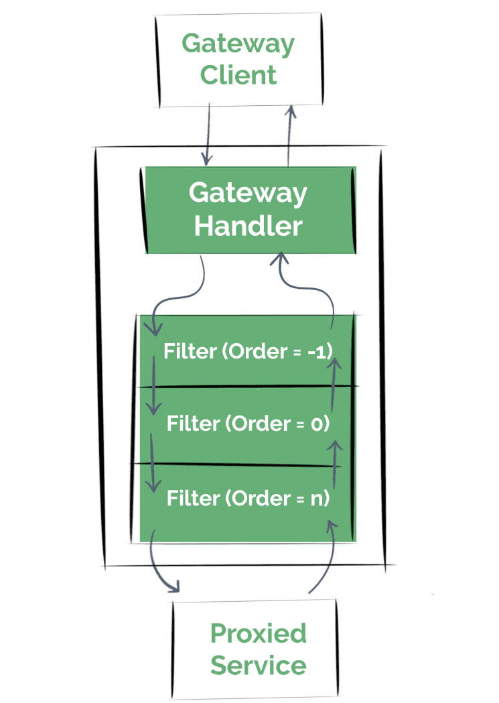

### This is a simple springboot 3 project.

W3C http traceparent Headers:
base16 version (2)
base16 trace-id (32)
base16 parent-id (16)
base16 (trace-flags) (2)
traceparent=00-11111111111111111111111111111111-1234567890123456-00

https://stackoverflow.com/questions/76333429/micrometer-tracing-traceid-not-passing-into-downstream
After migrating to Spring Boot 3, you need to add an interceptor to RestTemplate.

This worked for me.

Add the library to pom.xml

<dependency>
    <groupId>io.zipkin.brave</groupId>
    <artifactId>brave-instrumentation-spring-web</artifactId>
</dependency>
Add TracingClientHttpRequestInterceptor to RestTemplate

import brave.Tracing;
import brave.http.HttpTracing;
import brave.spring.web.TracingClientHttpRequestInterceptor;
@Bean
public HttpTracing create(Tracing tracing) {
return HttpTracing
.newBuilder(tracing)
.build();
}

@Bean
public RestTemplate restTemplate(HttpTracing httpTracing) {
return new RestTemplateBuilder()           
.interceptors(TracingClientHttpRequestInterceptor.create(httpTracing))
.build();
}

---

